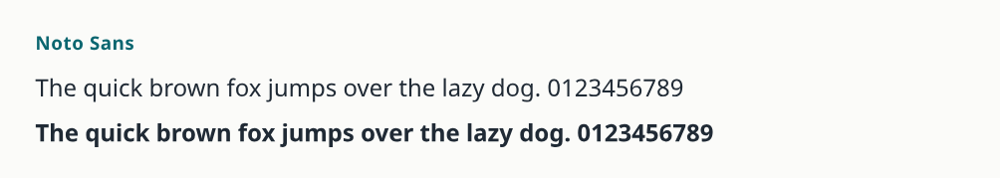

# Fonts

md2book typesets every edition with one of six curated font sets. The
book's [`font.family`](configuration.md#page-and-fonts) picks the set
(the deprecated `font_set` still picks the Noto set of the language):

| `font.family`           | Set              | Body typeface         | Styles                                       |
| ----------------------- | ---------------- | --------------------- | -------------------------------------------- |
| `noto-sans-myanmar`     | `my-sans`        | Noto Sans Myanmar     | regular, semibold, bold, italic, bold italic |
| `masterpiece-uni-round` | `my-masterpiece` | Masterpiece Uni Round | regular                                      |
| `padauk`                | `my-padauk`      | Padauk                | regular, semibold, bold                      |
| `noto-serif-myanmar`    | `my-serif`       | Noto Serif Myanmar    | regular, semibold, bold, italic, bold italic |
| `noto-sans`             | `en-sans`        | Noto Sans             | regular, semibold, bold, italic, bold italic |
| `noto-serif`            | `en-serif`       | Noto Serif            | regular, semibold, bold, italic, bold italic |

Every Myanmar set also covers Latin text. Where a set has no bold or
italic face, the renderer draws a synthetic bold or slant, and the QA
report says so. Code and terminal blocks always use Noto Sans Mono
(with Myanmar) in regular and bold, whatever the family.

## Previews

Each Myanmar set shows the Myanmar pangram, which uses every consonant
of the alphabet, in regular and then in bold, and a line of Latin text.
The images are rendered the way the PDF edition renders text, so the
Masterpiece Uni Round bold is the synthetic one your book gets.

### Noto Sans Myanmar


### Masterpiece Uni Round


### Padauk


### Noto Serif Myanmar


### Noto Sans



### Noto Serif


## Licences

Every font md2book downloads is licensed under the
[SIL Open Font License 1.1](https://openfontlicense.org), and its
licence file is saved with it.

| Typeface                                  | Source and version                      | Notes                                                                 |
| ----------------------------------------- | --------------------------------------- | --------------------------------------------------------------------- |
| Noto Sans/Serif (Myanmar), Noto Sans Mono | Google Noto releases                    | Myanmar faces merged with the Noto Latin faces                        |
| Padauk                                    | SIL, version 6.000                      | shipped unmodified: its licence reserves the name "Padauk"            |
| Masterpiece Uni Round                     | Prahita Opensource Project, version 1.0 | merged with Noto Sans Latin (it has no Latin letters); space narrowed |

Myanmar Census and NamKhone Unicode were considered but are not
offered, because their licences do not clearly allow redistribution.

## Fetching

```console
$ md2book fonts
$ md2book fonts --set en-serif
```

`md2book fonts` downloads the set once, checks every file's SHA-256
against the manifest shipped in the package, and caches it. Files that
are already cached and intact are not downloaded again, so the command
is safe to rerun. After that, every command works offline.

A command that needs a set that is not cached stops and prints the
`md2book fonts` command to run.

## Cache

The cache root is the first of:

1. `--fonts <dir>`
2. `MD2BOOK_FONTS`
3. `$XDG_CACHE_HOME/md2book/fonts`
4. `~/.cache/md2book/fonts`

`--fonts` exists only on `fonts` and `cover`; the build commands find
the cache through `MD2BOOK_FONTS` or the defaults. Each set is kept in
its own folder under the root (`<root>/my-sans/`, …). Several books with
the same set share one download.

## Offline and mirrors

`MD2BOOK_FONTS_SOURCE` fetches the files from somewhere else: a mirror
URL, or a local folder holding the same files. The checksums are still
verified, so a mirror cannot change the fonts.

```console
$ MD2BOOK_FONTS_SOURCE=/media/usb/md2book-fonts md2book fonts
```

To prepare a machine without internet access, copy a filled cache root
to it and point `MD2BOOK_FONTS` at it.

## Environment variables

| Variable               | Meaning                                        |
| ---------------------- | ---------------------------------------------- |
| `MD2BOOK_FONTS`        | cache root                                     |
| `MD2BOOK_FONTS_SOURCE` | mirror URL or local folder with the same files |
| `XDG_CACHE_HOME`       | base of the default cache root                 |
